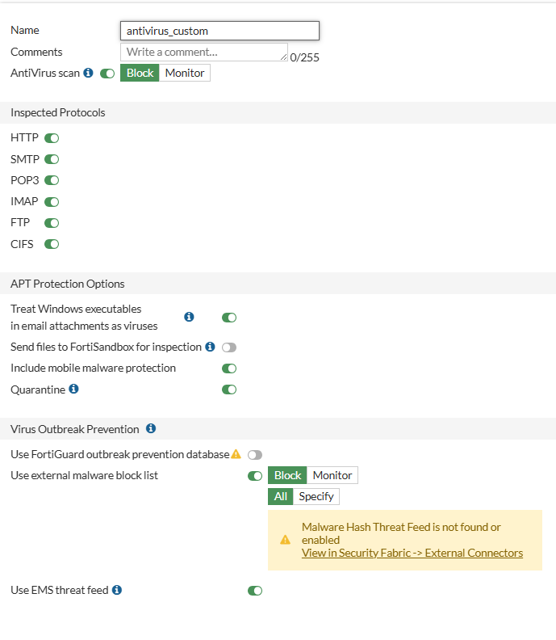

# FortiGate - FortiOS

## Indices

- [Baixando a imagem](#baixando-a-imagem)
- [Configurando interfaces - VMware](#configurando-interfaces-de-redes-do-vmware-workstation)
- [Configurando interfaces FortiGate](#configurando-interface-cli)
- [Dashboard](#dashboard)
- [Configurações iniciais](#configurações-iniciais)
    - [Configurando interface LAN](#configurando-interface-lan)
    - [Configurando interface WAN](#configurando-interface-wan)
    - [Overview interfaces](#overview-interfaces)
    - [Usuários administrativos](#usuários-administrativos)
        - [Criando usuário administrativo](#criando-usuário-administrativo)
    - [Configurando DHCP Server](#configurando-dhcp-server)
    - [Criando DNS Server](#criando-dns-server)
    - [Backup de configuração](#backup-de-configuração)
        - [Revisions](#revisions)
- [Configurando o firewall](#configurando-o-firewall)
    - [Criando policitas de firewall](#criando-policitas-de-firewall)
    - [Criando e utilizando objetos](#criando-e-utilizando-objetos)
        - [Politica com autenticação](#policitas-com-autenticação)
        - [Captive portal](#captive-portal)
- [Configuração de NAT](#configuração-de-nat)
- [Security profiles](#security-profiles)
    - [Criando uma DMZ](#criando-uma-dmz)
    - [AntiVirus](#antivirus)
    - [Criando arquivo "infectado"](#criando-arquivo-infectado)
    - [Web filter](#web-filter)
    - [DNS filter](#dns-filter)
    - [Application control](#application-control)
    - [IPS | Intrusion Prevention](#ips--intrusion-prevention)
    - [File filter](#file-filter)

## Baixando a imagem

Para podermos instalar em nosso hypervisor, é necessário baixarmos a imagem da VM, já disponibilizada pela FortiNet, para isso acesse <a href="https://www.forticloud.com">Forticloud</a> , faça login caso já tenha uma conta, se não, basta criar uma conta nova.

Na sequência, você terá acesso a area para fazer downloads indo <a href="https://support.fortinet.com/support/#/downloads/vm">aqui</a> , escolha a opção que tenha **New deployment of FortiGate**, descompacte o arquivo e execute o **FortiGate-VM64** , considerando que você esta utilizando o VMWare Workstation, ira abrir a area de importação de VMs, basta seguri o passo a passo padrão, defina um nome para VM.

## Configurando interfaces de redes do VMware Workstation

**Obs.: Por ser uma imagem trial, somos limitados a 3 interfaces!**

A nossa topolgia será de seguinte forma :

- maquina host(sua máquina) : 192.168.0.11/32
- FortiGate : Port1 -> 192.168.0.99/24 (Gerência do Firewall)
- LAN Corporativa : Port2 -> 192.168.197.0/24 (maquinas desktop, wireless)
- maquina cliente(cliente, usuario) -> 192.168.197.120

**Em outro momento usaremos essas outras redes, lembrando que iremos reaproveitar portas, reforçando que temos apenas 3 liberadas.**
- _Rede Insegura : ETH3 -> 10.20.20.0/24 (Cameras,VOIP)_
- _Rede Blindada : ETH4 -> 10.30.30.0/24 (Servidores isolados)_

## Configurando interface (CLI)

Logo após fazer o deploy da VM, acesse usando o login :

- admin
- senha em branco, apenas apertando **ENTER**
- será solicitado para então definir a senha de admin

Execute o comando a seguir para configurar a interface de gerência :

    config system interface
    edit port1
    show (com show você vê apenas informações dessa interface)
    set ip 192.168.0.99 255.255.255.0
    set allowaccess https ping ssh
    end

_o end faz com que a configuração seja salva!_

Para validar o acesso tente pingar da sua máquina para o IP de gerência e acessar pelo seu browser!

Ao acessar pela primeira vez será solicitado para fazer o registro da licença, que usaremos a **Evaluation License** , mas para isso é necessário que sua segunda interface tenha acesso a internet, então configure-a :

    config system interface
    edit port2
    set mode dhcp
    end

Valide de dentro do seu FortiGate se consegue pingar num IP publico :

    execute ping 8.8.8.8

Agora com a saida para internet funcionando, escolha **Evaluation License** :

Informa o seu login criado na FortiCloud, para que o registro da VM seja realizado, o FortiGate será reiniciado no processo.

### Dashboard

Uma vez logado dentro do seu FortiGate, você vai cair de cara na **Dashboard/Status**, onde você pode ter informações básicas de :

- System information
- Licenses
- CPU
- Memory
- Sessions
- etc

## Configurações iniciais

### Configurando interface LAN

A interface LAN, será nossa port2, para isso vamos em **Network/Interfaces**, selecionamos dentro de **Physical Interface** e port2, clique 2x para editar.

- Defina um nome/alias para a interface, facilitando a identificação.
- Escolha a Role, no caso LAN.
- Addressing mode, você pode escolher o tipo, mas em nosso laboratorio optem por **MANUAL**.
- Defina o IP, caso tenha escolhido MANUAL.
- Administrative Access:
    - Selecione o que vai ser possivel fazer nessa interface, como acesso HTTPS, PING.

- Por ser uma interface LAN, acredito que queira distribuir os IPs de forma mais dinamica. Então será necessário marcar DHCP Server, definir o Range, adicionar netmask , default gateway,se necessáro também um DNS server.

### Configurando interface WAN

A interface WAN, será nossa port1, seguimos na mesma tela ainda de **Network/Interfaces**, clicamos 2x na port1 para editar.

- Defina um nome/alias para a interface, em meu exemplo coloquei como se fosse o link de um provedor de internet.
- Escola a Role, que será WAN.
- Addressing mode, escolha **MANUAL**, note que dessa vez não aparecera para ter um server DCHP, pois essa será nossa interface de gerencia, não precisamos distribuir IP nela. Mas nada impende de no futuro criar uma interface/VLAN apenas para gerencia.

### Overview interfaces

Agora nossas interfaces devem estar dessa forma, note que no canto direito esta filtrado como **Group By Role**, ou seja, a visualização será baseada na Role definida, assim facilitando a identificação de LAN,WAN, etc.

- IP/Netmask , podemos ver o IP da interface e a netmask.
- Administrative access, podemos ver os serviços acessiveis por essas interfaces.
- DHCP Clients, podemos ver a quantidade de clients que receberam IP via DHCP.
- DHCP Range, é o range de IP que definimos dentro da interface.

## Usuários administrativos

Usuários administrativos, como o próprio nome sugere, são contas usadas para administrar o FortiGate (acessar a GUI/CLI, criar políticas, configurar objetos etc.).
São usuários de administração do equipamento.

Vá em **System/Administratos**, depois clique em **Create New**

- Administrator :

    - Usuário criado em System → Administrators.
    - Pode acessar a GUI/CLI para gerenciar e configurar o FortiGate.
    - Pode ter perfis de acesso diferentes (ex.: super_admin, read-only, perfil customizado).
    - A autenticação pode ser local, LDAP, RADIUS, etc.

- Rest API Admin :

    - Usuário especial também criado em System → Administrators, mas com tipo “REST API Admin”.
    - Não é para login humano na GUI/CLI.
    - Usado para integrações via API (ex.: scripts em Python, integrações com Zabbix, Grafana, SIEM, n8n, etc.).
    - Gera um API Token em vez de senha.
    - Tem os mesmos perfis de permissão (pode ser limitado só a certas funções).
    - Recomendado para automação e integração de sistemas.

- SSO Admin :

_Trecho retirado da documentação_

<i>Os administradores de SSO são criados automaticamente quando o FortiGate atua como um provedor de serviços SAML (SP) com o SAML Single Sign-On habilitado nas configurações do Security Fabric.
Na página de login do sistema, um administrador pode efetuar login com seu nome de usuário e senha no FortiGate raiz, atuando como provedor de identidade (IdP) no Security Fabric. Após o primeiro login bem-sucedido, esse usuário é adicionado à tabela de administradores ( Sistema > Administradores em Administrador de Logon Único ). O perfil padrão selecionado é baseado nas configurações do SP ( Perfil de administrador padrão ). Consulte Configurando um FortiGate downstream como um SP para obter mais informações.</i>

### Criando usuário administrativo

Escolha Administrator, o tipo aqui iremos escolher **Local**, defina o nome de usuário e senha. Após isso em **Admministrator profile**, será o perfil de acesso desse usuário, o que ele pode ou não fazer, você ainda pode criar um perfil customizado, clicando em Create.

Nesse exemplo, definimos que o usuário terá apenas permissão para visualizar :

- Network
- System
- Security Profile

- Two-factor authentication : apenas funciona caso você tenha na sua licença FortiToken Cloud ou se tiver o FortiToken fisico.

### Configurando DHCP Server

O DHCP Server, será usado na nossa interface LAN e qualquer outra interface que queiramos, para fazer isso, clique na interface que quer habilitar o DHCP server e a edite.

### Criando DNS Server

Imagine o cenário onde na empresa todos os ambientes não são publicados, então você precisa configurar uma DNS Server, em vez de ficar adicionandno os hosts manualmente em cada dispositivo/máquina, para isso você pode criar um DNS Server, indo em **Network/DNS Server**.

Em **DNS Service on Interface** , você vai escolher qual interface será usada

Em **DNS Database**, você vai criar as zonas baseado nos dominios

Depois você precisa criar as zonas, é como fazer no Active Directory

Uma vez criado e configurado, o usuário da interface LAN, vai conseguir resolver o host:

### Backup de Configuração

É de extrama importância que seja feito backup se possivel diariamente do FGT através de alguma automação e importante entender como funciona, para isso você clica no canto direito superior, onde aparece o seu usuário logado, clicar em **Configuration/Backup**

Caindo nessa tela:

- Backup to : Escolhemos **Local PC**, para podermos baixar em nossa maquina
- File Format : A dirença entre FortiOS e YAML, é que FortiOS fica exatamente da mesma forma que configuramos via CLI.
- Password mask : Use essa opção apenas se for enviar o arquivo para um terceiro ou a própria FortiNet, esse arquivo não serve para restore, devido ao hash da senha que vai ser perdido.
- Encryption : literalmente criptografar o arquivo com uma senha.

Para restaurar não tem misterio, é apenas escolher Restore, escolher o arquivo para upload e caso tenha definido senha, informar.

#### Revisions

É equivalente a fazer um snapshot, um ponto de restauração, quando você quer realizar alguma alteração, você criar essa revision e depois de criada, pode fazer as alterações, caso algo dê errado, basta voltar a revision, mas claro que, acredito que o recomendado seja, entrou no FGT, faça backup.

## Configurando o firewall

### Criando policitas de firewall

De forma direta e objetiva, as regras ou policy como são chamadas no FortiGate, consiste no conceito de onde você quer sair e para onde você vai, exemplo :

- Você esta conectado na LAN, porém sem acesso a internet, então é preciso criar uma policy que permita sua saida pela LAN para a INTERNET.

Então, vamos criar na pratica, primeiro é necessário entender que as policy são lidas de cima para baixo(top down), segue um print :

De forma implicita, todo trafego é bloqueado, para que você possa então criar as policy e ir liberando acessos conforme necessário e ou solicitado. Para criar uma nova policy basta clicar em **Create New**.

- Name : para você definir o nome da policy.
- Incoming interface : A interface de origem
- Outgoing intarface : A interface de saida
- Source : A origem, pode ser um IP, um grupo de IPs, etc
- Destination : Pode ser como destino tudo na internet(ALL),etc.

- Schedule : permite que você possa agendar que uma determinada policy fique ativa durante um periodo de dias e horário, pense no caso de um consultor que precisa usar uma VPN, mas só pode em dias uteis e horário comercial, então seria mais ou menos essa a ideia do schedule.

- Action : Basicamente se é para liberar o acesso ou negar.

- Firewall/Network Options

    - NAT : Aqui na verdade é um PNAT, onde da forma que esta confiurada no print, onde vai ser alterar apenas a porta que o host vai assumir durante a sessão. Abordaremos mais pra frente sobre NAT.

- Security Profiles : Também iremos abordar mais a frente, mas são basicamentes filtros que aplicamos para analisar pacotes e bloquear, filtro de antivirus, etc.

#### Regra criada

Como dito anteriormente, a primeira regra default/implicita no firewall é um DENY total, e agora criamos uma regra que permite acesso total para internet. A partir de agora qualquer regra que queiramos criar para fazer bloqueios deve ser acima da web_access, segue exemplo abaixo, onde faremos um bloqueio para o instagram e facebook, e qualquer outro destino estará livre.

**Regra de bloqueio**

**Log da tentativa de conexão para instagram**

### Criando e utilizando objetos

No FortiGate, o **addresses** se assemelha ao "alias" do pfSense, mas de forma diferente, onde na verdade aqui são tratados como **Objetos de rede** que representam :

- Um IP único
- Uma sub-rede
- Um range d IPs
- Um FQDN
- Uma interface local
- Um grupo de endereços

E são usados quando vamos criar regras de firewall(politicas), policitas de NAT, roteamento, VPN, entre outras., no exemplo da regra de bloqueio ao acesso a redes sociais anterior, você pode ver que o Destination é "Sociais", nesse Address Group, estão os FQDNs :

### Policitas com autenticação

É possivel fazer com que, ao equipamento(desktop ou notebook), solicite um login de autenticação para poder utilizar a rede:

Nessa regra, foi especificado que qualquer host dentro da rede LAN precisa ter autenticação do usuario, caindo nessa tela:

Depois de devidamente autenticado, o acesso a internet e ping esta liberado.

### Captive Portal

Bem comum quando você vai se conectar numa rede wi-fi de um super mercado, um banco, etc, e essa configuração é habilitada na interface que deseja que tenha, basta editar a interface e ir em **Network/Security mode**:

## Configuração de NAT

O NAT (Conversão de Endereços de Rede) é um recurso que permite alterar o endereço IP de origem ou destino de um pacote IP quando ele passa por um roteador ou firewall.
Ele surgiu porque os endereços IPv4 públicos são limitados, então o NAT possibilita que vários dispositivos de uma rede privada (endereços RFC 1918, como 192.168.x.x, 10.x.x.x e 172.16.x.x-172.31.x.x) compartilhem um único IP público para acessar a Internet.

Quando criamos uma policy, de forma nativa já tem um NAT configurado:

Sendo que dessa forma, ele vai usar o IP do host 

Para fazer o NAT sem usar a policy, vamos em Virtual IPs, e la fazemos a criação do NAT

se quisermos usar um pool de ips de um provedor de internet que a empresa usa por exemplo, também é possivel em IP pools.

exemplo de static NAT

### Como funciona

Quando um dispositivo da LAN (rede interna) tenta acessar algo na Internet:

- Ele envia um pacote com:

        Origem: IP privado (ex: 192.168.1.10)

        Destino: IP público (ex: 8.8.8.8)

- O roteador/firewall com NAT intercepta o pacote e troca o IP de origem para o IP público da WAN (ex: 200.200.200.10).

- Para diferenciar vários dispositivos internos usando o mesmo IP público, o NAT também troca a porta de origem (ex: de 54321 para 40001).

- Mantém uma tabela de tradução:

        192.168.1.10:54321  ->  200.200.200.10:40001
        192.168.1.20:54322  ->  200.200.200.10:40002

- Quando a resposta chega da Internet, o roteador consulta essa tabela e entrega o pacote ao host interno correto.

### Tipos de NAT

Existem variações importantes:

- DNAT (Destination NAT)

        Tradução do IP de destino.

        Usado para publicar um servidor interno para fora.

        Exemplo: Port Forwarding (mapear porta 80 externa → servidor web interno).

- PAT (Port Address Translation)

        Vários IPs internos usam o mesmo IP público, diferenciados por portas.

        É o NAT mais usado em roteadores domésticos e corporativos.

- NAT Estático

        Um IP interno mapeado fixamente para um IP público.

        Exemplo: 192.168.1.100 ↔ 200.200.200.50.

- NAT Dinâmico

        Usa um pool de IPs públicos e mapeia dinamicamente cada IP interno para um deles.

## Security profiles

### Criando uma DMZ

Essa DMZ, é mas para podermos simular um webserver vulneravel/infectado. 
Para criar, em nosso virtualizador(estamos usando o VMWare Workstation), basta adicionar uma nova interface ao FortiGate, do tipo **host-only**. Crie um novo host que vai ficar nessa rede DMZ, configure da mesma forma que fizemos na interface LAN.

É importante lembrar que essas redes a principio não vão ter comunicação, então, será necessário criar policys, faça a policy **LAN_TO_DMZ**, permitindo acesso da rede LAN para a rede DMZ liberando os serviços web(ping,https,dns,etc). Agora você vai conseguir se comunicar com ela, mas o contrario não vai acontecer, por enquanto é isso que queremos.

- Policy LAN_TO_DMZ

#### AntiVirus

Dentro da policy, no campo **Security Profiles**, selecione **AntiVirus**, irei usar o nome como _antivirus_custom_ , a ação do AntiVirus scan, será **Block**, os protocolos inspecionados, você pode marcar todos ou apenas o que quer inspecionar, em nosso caso vamos deixar todos habilitados. Demais campos vale uma leitura na documentação disponivel <a href="https://docs.fortinet.com/document/fortigate/7.6.4/administration-guide/836396/antivirus">aqui</a> .

#### Criando arquivo "infectado"

No seu host webserver, rode esse comando no terminal :

    # cria o arquivo EICAR
    echo -n 'X5O!P%@AP[4\PZX54(P^)7CC)7}$EICAR-STANDARD-ANTIVIRUS-TEST-FILE!$H+H*' > /tmp/eicar.com

    # serve por HTTP na porta 8000 (não precisa de root)
    cd /tmp
    python3 -m http.server 8000

Ira criar um arquivo malicioso de testes e subir um server web na porta 8000.

Em seu host da rede LAN, acesse :

    http://192.168.17.10:8000/eicar.com

Se tudo estiver feito corretamente, teremos esse retorno:

Virus detectado e barrado.

#### Web filter

Para testarmos o web filter, vamos usar a LAN_TO_WAN, mais facil de testar sem tantas configurações, na policy, ative **Web filter**, e iremos criar um filter customizado, para entendermos o que cada coisa faz:

- FortiGuard Category Based Filter : É uma base de dados da FortiGuard com destinos previamentes já cadastrados, porém só funciona se você tiver licença para uso.

- Allow users to override blocked categories : Permite que usuarios especificos passem por cima do bloqueio caso, ativado FortiGuard.

Para nosso laboratorio, iremos usar **Static URL Filter**, na opção **URL Filter**, ao habilitar, poderemos inserir manualmente o site que queremos bloquer:

#### DNS filter

O DNS Filter é um recurso de segurança do FortiGate que permite controlar e filtrar requisições DNS que passam pelo firewall. Basicamente, ele intercepta as solicitações de resolução de nomes de domínio e pode bloquear ou permitir o acesso com base em políticas configuradas.

#### Principais Funcionalidades

- **Filtragem de Categorias** : O FortiGate possui um banco de dados (FortiGuard) que categoriza milhões de domínios. Você pode bloquear categorias inteiras como:

    - Jogos online
    - Redes sociais
    - Conteúdo adulto
    - Malware e phishing
    - Streaming de vídeo

- **Proteção contra Ameaças**

    - Bloqueia acesso a domínios maliciosos conhecidos
    - Protege contra botnets e C&C (Command and Control)
    - Previne acesso a sites de phishing

- **Redirecionamento DNS** : Pode redirecionar requisições DNS para servidores específicos. Útil para forçar o uso de DNS interno da empresa

#### Como Funciona na Prática

Quando um usuário tenta acessar um site (ex: www.exemplo.com):

- O dispositivo envia uma requisição DNS
- O FortiGate intercepta essa requisição
- Verifica as políticas de DNS Filter configuradas
- Se permitido, resolve o endereço normalmente
- Se bloqueado, retorna um erro ou página de bloqueio

#### Onde Configurar
No FortiGate, você configura em:
**Security Profiles → DNS Filter** e depois aplica o perfil em uma política de firewall.

Obs.: É recomendado que fique habilitado :

**Enforce Safe Search on Google, Bing, YouTube

Obs.2 : Para utilizar o FortiGuard é necessário ter licença valida!

- Domain Filter, permite que você possa inserir quais DNS vão ser bloqueados, permitidos ou monitorados, funcinoa como no web filter.

- DNS Translation : funciona como um redirect para outro server DNS que queria utilizar.

#### Application control

É um recurso de segurança do FortiGate que permite **identificar, controlar e bloquear aplicações** baseado no tráfego de rede, independentemente da porta ou protocolo usado. Funciona como o web filter, sendo que de forma mais pratica, bastando que você adicione a aplicação que será tratada, exemplo, se quiser que não seja possivel abrir a chrome web store.

Ao tentar acessar a partir do chrome a web store, será barrado, claro depende da ação que será aplicada.

#### IPS | Intrusion Prevention

O IPS é um sistema de prevenção de intrusões que monitora o tráfego de rede em tempo real procurando por ataques, exploits e comportamentos maliciosos. Quando detecta algo suspeito, ele bloqueia automaticamente antes que cause dano.

Nesse exemplo está sendo aplicado o IPS para previnir um backdoor através do vsftpd.

#### File filter

O File Filter é um recurso de segurança que permite controlar quais tipos de arquivos podem trafegar pela rede. Ele identifica arquivos por extensão ou assinatura e pode bloquear, permitir ou registrar a transferência desses arquivos.

## Monitoramento e Logs

Logs são registros detalhados de tudo que acontece no FortiGate:

- Tráfego de rede
- Ataques bloqueados
- Sites acessados
- Autenticações
- Mudanças de configuração
- Eventos do sistema

### São essenciais para:

- Troubleshooting - Identificar problemas
- Segurança - Detectar ataques e incidentes
- Compliance - Atender auditorias e regulamentações
- Análise - Entender uso da rede
- Forense - Investigar incidentes de segurança
- Tipos de LogsO FortiGate gera vários tipos de logs:1. Traffic Logs (Logs de Tráfego)

### Registra todas as sessões que passam pelo firewall:

- IP origem e destino
- Portas
- Protocolo
- Bytes enviados/recebidos
- Duração da sessão
- Política aplicada
- Ação (allow/deny)

Exemplo:

    date=2025-10-02 time=20:30:15
    srcip=192.168.1.100 srcport=54321
    dstip=8.8.8.8 dstport=443
    proto=6 (TCP)
    action=accept policyid=10
    sentbyte=1500 rcvdbyte=50002. Security Logs (Logs de Segurança)
    Eventos dos security profiles:Antivirus Logs

### Níveis de SeveridadeOs logs têm níveis de severidade (0-7):

    Uso prático:

    Critical/Alert: Requer ação imediata
    Warning: Monitorar
    Info/Notification: Registro normal
