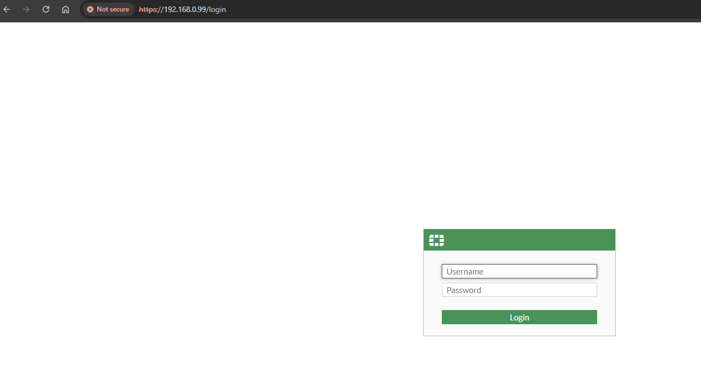

# FortiGate

## Indices

- [Baixando a imagem](#baixando-a-imagem)
- [Configurando interfaces - VMware](#configurando-interfaces-de-redes-do-vmware-workstation)
- [Configurando interfaces FortiGate](#configurando-interface-cli)
- [Dashboard](#dashboard)
- [Configurações iniciais](#configurações-iniciais)
    - [Configurando interface LAN](#configurando-interface-lan)
    - [Configurando interface WAN](#configurando-interface-wan)
    - [Overview interfaces](#overview-interfaces)
    - [Usuários administrativos](#usuários-administrativos)
        - [Criando usuário administrativo](#criando-usuário-administrativo)
    - [Configurando DHCP Server](#configurando-dhcp-server)
    - [Criando DNS Server](#criando-dns-server)
    - [Backup de configuração](#backup-de-configuração)

- [Network](#network)
- [Physical interface](#physical-interface)
- [Software switch](#software-switch)
- [SD-WAN](#sd-wan)
    - [Criando SD-WAN](#criando-a-sd-wan)
- [Policy & Objects](#policy--objects)
    - [Addresses](#addresses)
    - [Firewall Policy](#firewall-policy)
    - [NAT | VIP]

## Baixando a imagem

Para podermos instalar em nosso hypervisor, é necessário baixarmos a imagem da VM, já disponibilizada pela FortiNet, para isso acesse <a href="https://www.forticloud.com">Forticloud</a> , faça login caso já tenha uma conta, se não, basta criar uma conta nova.

Na sequência, você terá acesso a area para fazer downloads indo <a href="https://support.fortinet.com/support/#/downloads/vm">aqui</a> , escolha a opção que tenha **New deployment of FortiGate**, descompacte o arquivo e execute o **FortiGate-VM64** , considerando que você esta utilizando o VMWare Workstation, ira abrir a area de importação de VMs, basta seguri o passo a passo padrão, defina um nome para VM.

## Configurando interfaces de redes do VMware Workstation

**Obs.: Por ser uma imagem trial, somos limitados a 3 interfaces!**

A nossa topolgia será de seguinte forma :

- maquina host(sua máquina) : 192.168.0.11/32
- FortiGate : Port1 -> 192.168.0.99/24 (Gerência do Firewall)
- LAN Corporativa : Port2 -> 192.168.197.0/24 (maquinas desktop, wireless)
- maquina cliente(cliente, usuario) -> 192.168.197.120

**Em outro momento usaremos essas outras redes, lembrando que iremos reaproveitar portas, reforçando que temos apenas 3 liberadas.**
- _Rede Insegura : ETH3 -> 10.20.20.0/24 (Cameras,VOIP)_
- _Rede Blindada : ETH4 -> 10.30.30.0/24 (Servidores isolados)_

## Configurando interface (CLI)

Logo após fazer o deploy da VM, acesse usando o login :

- admin
- senha em branco, apenas apertando **ENTER**
- será solicitado para então definir a senha de admin

Execute o comando a seguir para configurar a interface de gerência :

    config system interface
    edit port1
    show (com show você vê apenas informações dessa interface)
    set ip 192.168.0.99 255.255.255.0
    set allowaccess https ping ssh
    end

_o end faz com que a configuração seja salva!_

Para validar o acesso tente pingar da sua máquina para o IP de gerência e acessar pelo seu browser!

Ao acessar pela primeira vez será solicitado para fazer o registro da licença, que usaremos a **Evaluation License** , mas para isso é necessário que sua segunda interface tenha acesso a internet, então configure-a :

    config system interface
    edit port2
    set mode dhcp
    end

Valide de dentro do seu FortiGate se consegue pingar num IP publico :

    execute ping 8.8.8.8

Agora com a saida para internet funcionando, escolha **Evaluation License** :

Informa o seu login criado na FortiCloud, para que o registro da VM seja realizado, o FortiGate será reiniciado no processo.

### Dashboard

Uma vez logado dentro do seu FortiGate, você vai cair de cara na **Dashboard/Status**, onde você pode ter informações básicas de :

- System information
- Licenses
- CPU
- Memory
- Sessions
- etc

## Configurações iniciais

### Configurando interface LAN

A interface LAN, será nossa port2, para isso vamos em **Network/Interfaces**, selecionamos dentro de **Physical Interface** e port2, clique 2x para editar.

- Defina um nome/alias para a interface, facilitando a identificação.
- Escolha a Role, no caso LAN.
- Addressing mode, você pode escolher o tipo, mas em nosso laboratorio optem por **MANUAL**.
- Defina o IP, caso tenha escolhido MANUAL.
- Administrative Access:
    - Selecione o que vai ser possivel fazer nessa interface, como acesso HTTPS, PING.

- Por ser uma interface LAN, acredito que queira distribuir os IPs de forma mais dinamica. Então será necessário marcar DHCP Server, definir o Range, adicionar netmask , default gateway,se necessáro também um DNS server.

### Configurando interface WAN

A interface WAN, será nossa port1, seguimos na mesma tela ainda de **Network/Interfaces**, clicamos 2x na port1 para editar.

- Defina um nome/alias para a interface, em meu exemplo coloquei como se fosse o link de um provedor de internet.
- Escola a Role, que será WAN.
- Addressing mode, escolha **MANUAL**, note que dessa vez não aparecera para ter um server DCHP, pois essa será nossa interface de gerencia, não precisamos distribuir IP nela. Mas nada impende de no futuro criar uma interface/VLAN apenas para gerencia.

### Overview interfaces

Agora nossas interfaces devem estar dessa forma, note que no canto direito esta filtrado como **Group By Role**, ou seja, a visualização será baseada na Role definida, assim facilitando a identificação de LAN,WAN, etc.

- IP/Netmask , podemos ver o IP da interface e a netmask.
- Administrative access, podemos ver os serviços acessiveis por essas interfaces.
- DHCP Clients, podemos ver a quantidade de clients que receberam IP via DHCP.
- DHCP Range, é o range de IP que definimos dentro da interface.

## Usuários administrativos

Usuários administrativos, como o próprio nome sugere, são contas usadas para administrar o FortiGate (acessar a GUI/CLI, criar políticas, configurar objetos etc.).
São usuários de administração do equipamento.

Vá em **System/Administratos**, depois clique em **Create New**

- Administrator :

    - Usuário criado em System → Administrators.
    - Pode acessar a GUI/CLI para gerenciar e configurar o FortiGate.
    - Pode ter perfis de acesso diferentes (ex.: super_admin, read-only, perfil customizado).
    - A autenticação pode ser local, LDAP, RADIUS, etc.

- Rest API Admin :

    - Usuário especial também criado em System → Administrators, mas com tipo “REST API Admin”.
    - Não é para login humano na GUI/CLI.
    - Usado para integrações via API (ex.: scripts em Python, integrações com Zabbix, Grafana, SIEM, n8n, etc.).
    - Gera um API Token em vez de senha.
    - Tem os mesmos perfis de permissão (pode ser limitado só a certas funções).
    - Recomendado para automação e integração de sistemas.

- SSO Admin :

_Trecho retirado da documentação_

<i>Os administradores de SSO são criados automaticamente quando o FortiGate atua como um provedor de serviços SAML (SP) com o SAML Single Sign-On habilitado nas configurações do Security Fabric.
Na página de login do sistema, um administrador pode efetuar login com seu nome de usuário e senha no FortiGate raiz, atuando como provedor de identidade (IdP) no Security Fabric. Após o primeiro login bem-sucedido, esse usuário é adicionado à tabela de administradores ( Sistema > Administradores em Administrador de Logon Único ). O perfil padrão selecionado é baseado nas configurações do SP ( Perfil de administrador padrão ). Consulte Configurando um FortiGate downstream como um SP para obter mais informações.</i>

### Criando usuário administrativo

Escolha Administrator, o tipo aqui iremos escolher **Local**, defina o nome de usuário e senha. Após isso em **Admministrator profile**, será o perfil de acesso desse usuário, o que ele pode ou não fazer, você ainda pode criar um perfil customizado, clicando em Create.

Nesse exemplo, definimos que o usuário terá apenas permissão para visualizar :

- Network
- System
- Security Profile

- Two-factor authentication : apenas funciona caso você tenha na sua licença FortiToken Cloud ou se tiver o FortiToken fisico.

### Configurando DHCP Server

O DHCP Server, será usado na nossa interface LAN e qualquer outra interface que queiramos, para fazer isso, clique na interface que quer habilitar o DHCP server e a edite.

### Criando DNS Server

Imagine o cenário onde na empresa todos os ambientes não são publicados, então você precisa configurar uma DNS Server, em vez de ficar adicionandno os hosts manualmente em cada dispositivo/máquina, para isso você pode criar um DNS Server, indo em **Network/DNS Server**.

Em **DNS Service on Interface** , você vai escolher qual interface será usada

Em **DNS Database**, você vai criar as zonas baseado nos dominios

Depois você precisa criar as zonas, é como fazer no Active Directory

Uma vez criado e configurado, o usuário da interface LAN, vai conseguir resolver o host:

### Backup de Configuração

É de extrama importância que seja feito backup se possivel diariamente do FGT através de alguma automação e importante entender como funciona, para isso você clica no canto direito superior, onde aparece o seu usuário logado, clicar em **Configuration/Backup**

Caindo nessa tela:

- Backup to : Escolhemos **Local PC**, para podermos baixar em nossa maquina
- File Format : A dirença entre FortiOS e YAML, é que FortiOS fica exatamente da mesma forma que configuramos via CLI.
- Password mask : Use essa opção apenas se for enviar o arquivo para um terceiro ou a própria FortiNet, esse arquivo não serve para restore, devido ao hash da senha que vai ser perdido.
- Encryption : literalmente criptografar o arquivo com uma senha.

Para restaurar não tem misterio, é apenas escolher Restore, escolher o arquivo para upload e caso tenha definido senha, informar.

### Network

Aqui é onde vamos administrar nossas interfaces de rede, SD-WAN, software-swith/VLAN, Tunnel interface, DNS, vamos por partes!

- Interfaces : A principio você verá suas interfaces fisicas, considerando que estamos numa versão de avaliação só nos permite ter 3 interfaces .

#### Physical interface

- port1 : Aqui usaremos essa port1 para ser a nossa porta de gerencia do FortiGate, apenas nossa maquina host deverá ter acesso a ela.

- port2 : Usaremos ela como nossa interface LAN, onde poderemos por exemplo conectar nela nosso Zabbix, nosso host Linux, note que essa interface permite saida para internet, como setamos anteriormente.

- port3 : Usaremos essa port para estudarmos sobre SD-WAN, que seria para verificar por qual link teriamos a melhor conexão,menor latência,etc.

A primeira port, já foi configurada no inicio, onde setamos que ela pegeria um IP statico,e que teriamos acesso https.

A segunda port, também setamos um IP nela porém de modo DHCP, apenas para podermos ter acesso a internet e registrar nosso FortiGate VM, porém depois de termos acesso a interface pelo browser, podemos por la alterar o modo para static, setar um IP,definir o que teremos acesso como:

- HTTPS
- SSH
- PING
- SNMP

A principio será bom que na port1 ter permissão HTTPS, SSH, PING, já na port2 deixar apenas PING e SNMP, para podermos fazer a coleta de metricas no nosso Zabbix+Grafana.

### Software Switch

Aqui, o soft-switch, seria como criar VLANs, a diferença é que a VLAN mesmo seria se fossemos conectar a porta num switch gerenciavel em redes trunk. Então como vai funcionar :

- A nossa port2 ela pega da interface do VMware Workstation o IP : 192.168.175.X ,porém queremos que nossa rede LAN seja 10.10.10.X/24, então para isso criamos uma nova interface do Type **Software Switch**, na role **LAN**, em Interface members selecionamos a port2, em **Addressing mode** escolhemos Manual, informando a subnet 10.10.10.0/24, em **Administrative Access** deixe ativo PING, SNMP, ative o **DHCP Server** e informe um range de IPs, o resto pode deixar tudo padrão até o momento.

_Vale ressaltar que o uso de soft-switch aumentará o consumo de CPU e aqui estamos limitados a 1 core!_

Se tivessemos mais ports disponiveis poderiamos criar a soft-switch para rede de **Convidados**, a rede **Blindada** de exclusividade dos servidores internos, etc, a ideia é entender o conceito e como usar.

### DNS

Na area de DNS, por padrão é utilizado o server da **FortiGuard**, mas se quisermos alterar para usar nosso próprio server de DNS como um Active Directory é possivél, basta apenas alterar para **Specify** e informar os IPs.

### SD-WAN

A SD-WAN, é uma abordagem para gerenciamento de redes WAN, onde o controle de tráfego é feito via software, e seu objetivo seria gerenciar de forma automática ,segura e eficiente com base em politicas e desempenho real de cada link.

A SD-WAN nos entrega :

- Load Balancer entre os links
- Failover caso um dos links caia
- Monitoramento de latência,packet loss
- Roteamento baseado em aplicações

Na prática seria o seguinte :

- Seu cliente tem 2 links de internet um da Brisanet de 600MB e um da Vivo de 200MB, e você define que ambos os links vão monitorar a Perfomancer SLAs para o google.com, e foi detectado que o link da Brisa esta com packet loss de 90%, com base nisso o roteamento iria ser alterado para usar o link da Vivo que na teoria não estaria com packet loss, melhorando então o trafego do cliente.

Mas de toda forma, o host sempre estara conectado a uma interface LAN, mas o seu tráfego de saida para internet será roteado pela SD-WAN, de acordo com as regras que forem criadas. 

#### Criando a SD-WAN

Iremos criar usamo a interface GUI, em Network/SD-WAN, na aba SD-WAN Zones,
você já vai ver que existe um virtual-wan-link, usaremos ele para nossa primeira SD-WAN, clique nele para que possamos editar e escolher a Interface member, que no nosso caso será a port3, clique no sinal de **+** e em port3 -> edit dexie o Gateway em Dinamyc para que pegue o Gateway default da interface, de um OK, e agora vá para **Perfomance SLAs**, por padrão teremos alguns destinos como:

- Default_FortiGuard
- Default_Gmail
- Default_Google Search

Basta editar e em participants escolher a port3 da SD-WAN, no fim teremos algo assim:

### Policy & Objects

#### Addresses

No FortiGate, o **addresses** se assemelha ao "alias" do pfSense, mas de forma diferente, onde na verdade aqui são tratados como **Objetos de rede** que representam :

- Um IP único
- Uma sub-rede
- Um range d IPs
- Um FQDN
- Uma interface local
- Um grupo de endereços

E são usados quando vamos criar regras de firewall(politicas), policitas de NAT, roteamento, VPN, entre outras.

#### Firewall Policy

Literalmente é regra de firewall, caso já tenha trabalhado com algum outro vai ser facil entender:

### NAT e VIP

Ao menos aqui na versão 7.6.3 funciona da seguinte forma:

- A policy a ser criado vai ser ondo o acesso se dá de fora para dentro,sendo assim

    - Incoming interface : sua SD-WAN
    - Outgoing interface : sua LAN ou soft-switch
    - Source : ALL
    - Destination : Pode ser sua propria LAN ou soft-switch aplicando a todo host daquela interface
    - Service : no caso utlizei web access, como se fosse permitindo o acesso externo ao nosso webserver na HTTP / HTTPS

Se deixarmos marcado o NAT já teriamos uma roteamento rolando a todos os hosts da interface Outgoing. Em nosso caso iremos utilizar do VIP.

### VIP

o VIP vai nos permitir fazer o redirecionamento para um host ou grupo de hosts especificos, sendo assim vamos em **Virtual IPs**, vá em Create New e informe :

- Name
- Network : a interface da sua WAN
- External IP address/range: se deixar 0.0.0.0 então é tudo permitido

Marque o Port Forwarding, e em :

- External port : informe a porta de origem
- Map to IPv4 port : Informe a porta interna do destino

Agora volte na policy que criamos antes e altere Destination para o seu VIP.

No fim teremos :

A policy

O VIP
