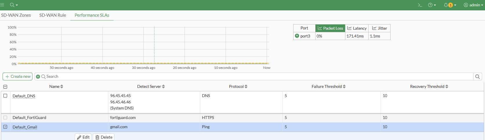

### Network

Aqui é onde vamos administrar nossas interfaces de rede, SD-WAN, software-swith/VLAN, Tunnel interface, DNS, vamos por partes!

- Interfaces : A principio você verá suas interfaces fisicas, considerando que estamos numa versão de avaliação só nos permite ter 3 interfaces .

#### Physical interface

- port1 : Aqui usaremos essa port1 para ser a nossa porta de gerencia do FortiGate, apenas nossa maquina host deverá ter acesso a ela.

- port2 : Usaremos ela como nossa interface LAN, onde poderemos por exemplo conectar nela nosso Zabbix, nosso host Linux, note que essa interface permite saida para internet, como setamos anteriormente.

- port3 : Usaremos essa port para estudarmos sobre SD-WAN, que seria para verificar por qual link teriamos a melhor conexão,menor latência,etc.

A primeira port, já foi configurada no inicio, onde setamos que ela pegeria um IP statico,e que teriamos acesso https.

A segunda port, também setamos um IP nela porém de modo DHCP, apenas para podermos ter acesso a internet e registrar nosso FortiGate VM, porém depois de termos acesso a interface pelo browser, podemos por la alterar o modo para static, setar um IP,definir o que teremos acesso como:

- HTTPS
- SSH
- PING
- SNMP

A principio será bom que na port1 ter permissão HTTPS, SSH, PING, já na port2 deixar apenas PING e SNMP, para podermos fazer a coleta de metricas no nosso Zabbix+Grafana.

### Software Switch

Aqui, o soft-switch, seria como criar VLANs, a diferença é que a VLAN mesmo seria se fossemos conectar a porta num switch gerenciavel em redes trunk. Então como vai funcionar :

- A nossa port2 ela pega da interface do VMware Workstation o IP : 192.168.175.X ,porém queremos que nossa rede LAN seja 10.10.10.X/24, então para isso criamos uma nova interface do Type **Software Switch**, na role **LAN**, em Interface members selecionamos a port2, em **Addressing mode** escolhemos Manual, informando a subnet 10.10.10.0/24, em **Administrative Access** deixe ativo PING, SNMP, ative o **DHCP Server** e informe um range de IPs, o resto pode deixar tudo padrão até o momento.

_Vale ressaltar que o uso de soft-switch aumentará o consumo de CPU e aqui estamos limitados a 1 core!_

Se tivessemos mais ports disponiveis poderiamos criar a soft-switch para rede de **Convidados**, a rede **Blindada** de exclusividade dos servidores internos, etc, a ideia é entender o conceito e como usar.

### DNS

Na area de DNS, por padrão é utilizado o server da **FortiGuard**, mas se quisermos alterar para usar nosso próprio server de DNS como um Active Directory é possivél, basta apenas alterar para **Specify** e informar os IPs.

### SD-WAN

A SD-WAN, é uma abordagem para gerenciamento de redes WAN, onde o controle de tráfego é feito via software, e seu objetivo seria gerenciar de forma automática ,segura e eficiente com base em politicas e desempenho real de cada link.

A SD-WAN nos entrega :

- Load Balancer entre os links
- Failover caso um dos links caia
- Monitoramento de latência,packet loss
- Roteamento baseado em aplicações

Na prática seria o seguinte :

- Seu cliente tem 2 links de internet um da Brisanet de 600MB e um da Vivo de 200MB, e você define que ambos os links vão monitorar a Perfomancer SLAs para o google.com, e foi detectado que o link da Brisa esta com packet loss de 90%, com base nisso o roteamento iria ser alterado para usar o link da Vivo que na teoria não estaria com packet loss, melhorando então o trafego do cliente.

Mas de toda forma, o host sempre estara conectado a uma interface LAN, mas o seu tráfego de saida para internet será roteado pela SD-WAN, de acordo com as regras que forem criadas. 

#### Criando a SD-WAN

Iremos criar usamo a interface GUI, em Network/SD-WAN, na aba SD-WAN Zones,
você já vai ver que existe um virtual-wan-link, usaremos ele para nossa primeira SD-WAN, clique nele para que possamos editar e escolher a Interface member, que no nosso caso será a port3, clique no sinal de **+** e em port3 -> edit dexie o Gateway em Dinamyc para que pegue o Gateway default da interface, de um OK, e agora vá para **Perfomance SLAs**, por padrão teremos alguns destinos como:

- Default_FortiGuard
- Default_Gmail
- Default_Google Search

Basta editar e em participants escolher a port3 da SD-WAN, no fim teremos algo assim:

### Policy & Objects

#### Addresses

No FortiGate, o **addresses** se assemelha ao "alias" do pfSense, mas de forma diferente, onde na verdade aqui são tratados como **Objetos de rede** que representam :

- Um IP único
- Uma sub-rede
- Um range d IPs
- Um FQDN
- Uma interface local
- Um grupo de endereços

E são usados quando vamos criar regras de firewall(politicas), policitas de NAT, roteamento, VPN, entre outras.

#### Firewall Policy

Literalmente é regra de firewall, caso já tenha trabalhado com algum outro vai ser facil entender:

### NAT e VIP

Ao menos aqui na versão 7.6.3 funciona da seguinte forma:

- A policy a ser criado vai ser ondo o acesso se dá de fora para dentro,sendo assim

    - Incoming interface : sua SD-WAN
    - Outgoing interface : sua LAN ou soft-switch
    - Source : ALL
    - Destination : Pode ser sua propria LAN ou soft-switch aplicando a todo host daquela interface
    - Service : no caso utlizei web access, como se fosse permitindo o acesso externo ao nosso webserver na HTTP / HTTPS

Se deixarmos marcado o NAT já teriamos uma roteamento rolando a todos os hosts da interface Outgoing. Em nosso caso iremos utilizar do VIP.

### VIP

o VIP vai nos permitir fazer o redirecionamento para um host ou grupo de hosts especificos, sendo assim vamos em **Virtual IPs**, vá em Create New e informe :

- Name
- Network : a interface da sua WAN
- External IP address/range: se deixar 0.0.0.0 então é tudo permitido

Marque o Port Forwarding, e em :

- External port : informe a porta de origem
- Map to IPv4 port : Informe a porta interna do destino

Agora volte na policy que criamos antes e altere Destination para o seu VIP.

No fim teremos :

A policy

O VIP
